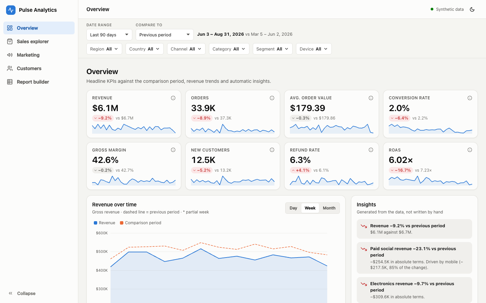
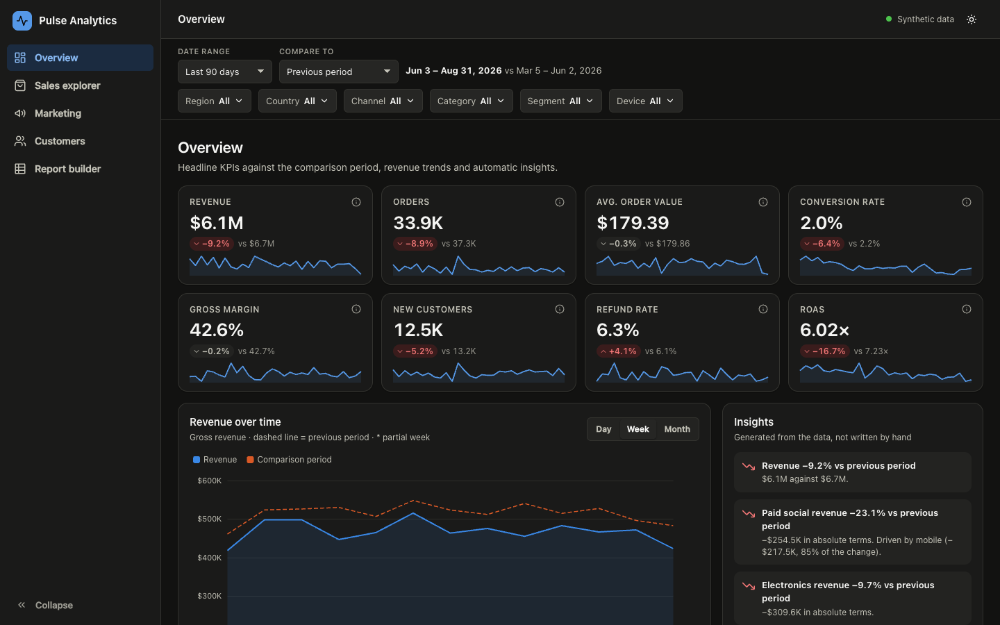
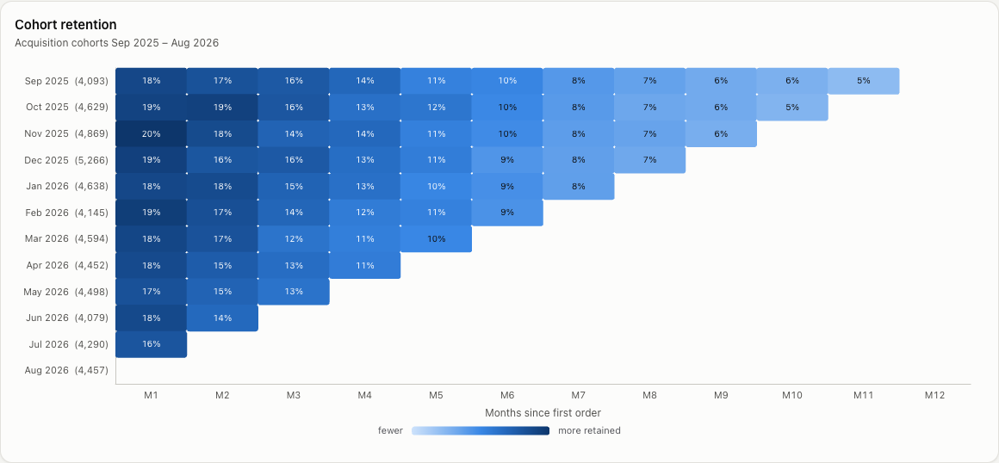
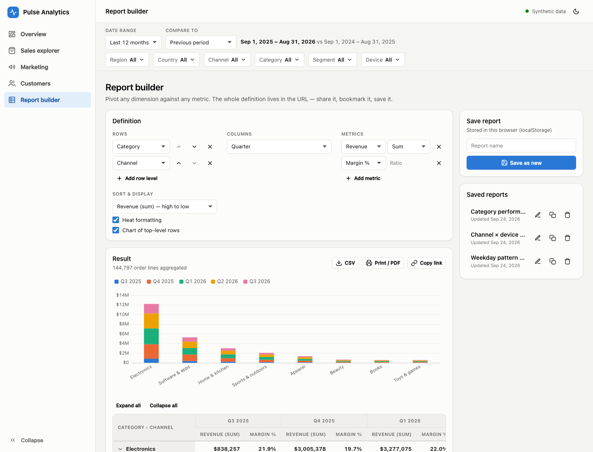
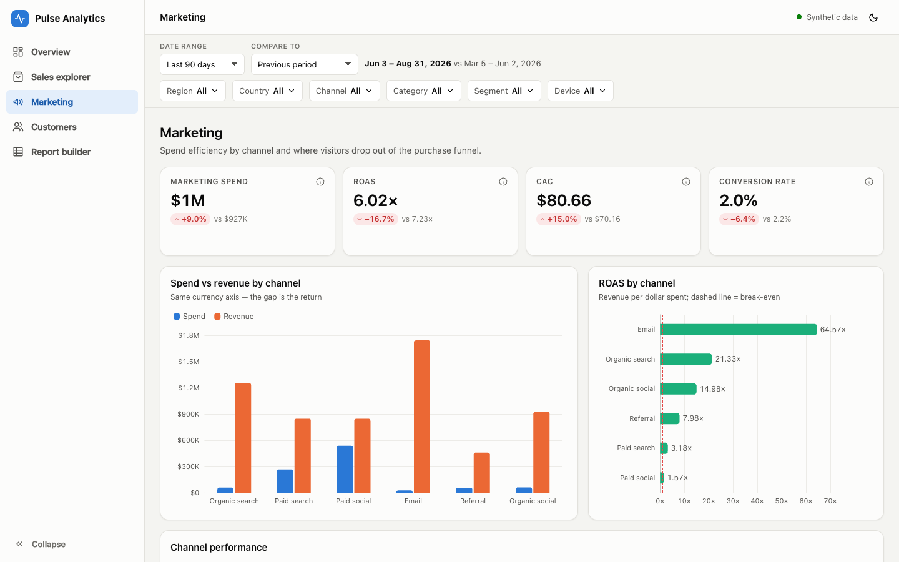
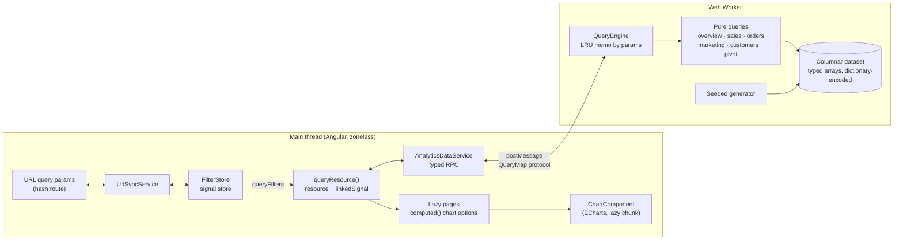

# Pulse Analytics

An in-browser BI dashboard for a fictional multi-region e-commerce business: KPIs with period comparison, sales drill-down, marketing funnel, cohort retention and a pivot-table report builder. About 286k order rows are generated and aggregated **inside a Web Worker**, so the UI thread only ever renders pre-aggregated results.

**Live demo:** https://usertrv.dev/projects/analytics-dashboard/

Built with Angular 22 (standalone, zoneless, signals), Apache ECharts and the Angular CDK. It has no backend: the whole app is a static bundle that makes no network calls after load.

> All data is **synthetic**. A deterministic seeded generator produces it: the same numbers on every load, no real customers.



| Dark theme | Cohort retention |
| --- | --- |
|  |  |

| Report builder | Marketing |
| --- | --- |
|  |  |

---

## Features

- **Global filters**: date presets (7d / 30d / 90d / QTD / YTD / 12m / custom), comparison period (previous period or same period last year), region → country, channel, category, segment and device. The filter state is written to the URL, so every view can be shared or bookmarked, and back/forward work.
- **Overview**: 8 KPI cards (revenue, orders, AOV, conversion, gross margin, new customers, refund rate, ROAS), each with a delta and a sparkline. Also a revenue trend with a day/week/month switch and a comparison overlay, revenue by channel, top categories (click one to drill down) and a region → country treemap.
- **Insights panel**: generated from the data. It lists channel movers with a driver search ("Paid social revenue −23% … driven by mobile, 85% of the change") and anomalies from a rolling z-score (|z| ≥ 3 against the trailing 28 days).
- **Sales explorer**: drill from category to products. The product table can be sorted, searched and paged, and has a column chooser. The order-level table covers 30k–285k rows with **CDK virtual scroll**, and the worker serves it in pages of 200.
- **Marketing**: spend vs revenue, ROAS with a break-even line, CAC, a purchase funnel and a step-conversion matrix by channel or device with heat shading.
- **Customers**: a **cohort retention heatmap** (monthly acquisition cohorts × months since first order), LTV curves by segment or first channel, a new vs returning split and rule-based RFM segments.
- **Report builder**: a pivot with up to 3 row levels and 1 column dimension, up to 4 metrics (sum / avg / min / max / count / distinct / ratio), subtotals, a grand total, collapsible groups, sorting, heat formatting and an optional chart. Report definitions can be saved (rename, duplicate, delete; stored in `localStorage`), exported to **CSV** (with a guard against formula injection) and printed to **PDF** through a print stylesheet. *Copy link* produces a URL that recreates the exact report.
- **UX**: light and dark themes (follows `prefers-color-scheme`, remembers an explicit choice, charts re-theme on switch), collapsible sidebar, off-canvas nav on phones, keyboard-accessible controls with visible focus, ARIA on custom widgets, `Intl` formatting, skeleton loaders, empty states and a skip link.

## Architecture



**Data flow.** The worker builds the dataset at startup (≈150 ms). A filter change updates a single signal in `FilterStore`. `UrlSyncService` pushes it to the URL as a new history entry and applies URL changes back to the store (back/forward, deep links), with equality checks on both sides so the two never ping-pong. Each page declares its query as `queryResource('overview', () => ({ filters: store.queryFilters() }))`: an Angular `resource()` whose loader is a typed call to the worker. A superseded request is aborted, and a `linkedSignal` keeps showing the previous result while the next one loads, so nothing flickers. Chart options are plain `computed()` values built by pure functions (`*-model.ts`), and `ChartComponent` applies them.

```
src/app
├── core
│   ├── data/        catalogue, seeded RNG, calendar effects, generator, traffic cube (framework-free)
│   ├── analytics/   metrics, date ranges, filters, bucketing, cohorts, RFM, pivot, anomalies, insights, CSV
│   │   └── queries/ one pure function per worker query + shared row scanning
│   ├── worker/      analytics.worker.ts, protocol (QueryMap), QueryEngine, main-thread fallback
│   └── state/       FilterStore, URL ⇄ state, UrlSyncService, ThemeService, data service, perf monitor
├── shared
│   ├── format/      Intl formatters, fmt pipe, heat scale, filter summary
│   └── ui/          chart, kpi-card, sparkline, multi-select (CDK overlay), segmented, panel, empty-state, icons
├── layout/          sidebar, filter bar
└── features/        overview · sales · marketing · customers · reports (each a lazy route)
```

### Data model

- **Orders**: 285,890 order lines over 32 months (2024-01-01 → 2026-08-31), stored as 14 typed-array columns. Dimensions such as country, channel, device, category, product and segment are dictionary-encoded as indices into a static catalogue. Rows are sorted by day, and `dayStart[]` turns any date range into one contiguous slice.
- **Customers**: 118,142 customers, each with the attributes captured at acquisition (first day, country, channel, device, segment), which is what cohorts and LTV need.
- **Traffic cube**: sessions, product views, carts, checkouts, purchases, revenue, new customers and spend per (day × country × channel × device), 315k cells. The funnel and spend have no category or segment, as in real analytics stacks. When those filters are active, the traffic-based metrics show a caveat instead of silently producing wrong ratios.
- **Realism**: the model includes weekly and yearly seasonality, Black Friday / Cyber Monday / December / summer-sale peaks with discounts, and Singles' Day in APAC. It also has growth (+30 %/yr, fastest in APAC), a paid-social share that grows while its CAC inflates, segment-specific repeat behaviour and refund rates by category. Three incidents are planted for the insights engine to find: a tracking outage (2025-03-14), a viral paid-social spike (2025-10-02), and a broken in-app checkout on mobile paid social from 2026-06-15, where traffic and spend stay flat but conversion halves.
- **Size**: about 25 MB of typed arrays, and all of it stays inside the worker.

## Performance (measured)

These figures were measured on an Apple M4 in headless Chrome 153 with the production build served from a sub-path.

| What | Result |
| --- | --- |
| Dataset generation in the worker | **125–165 ms** (the footer shows the live value) |
| First data on screen (local server, cold) | ~270 ms |
| **Filter change → all visible charts updated and painted** | median **21 ms** (Overview, 90 days) · **38 ms** (Overview, 12 months or all 32 months), p90 ≤ 54 ms |
| Worst single update | ~170 ms: the first update after a deep link, which also initialises the charts |

How it's measured: `PerfMonitor` starts a timer when `FilterStore.queryFilters` changes. It stops when no worker query is in flight *and* the next frame after Angular's render has been painted. Samples are exposed on `window.__pulsePerf`. The numbers above come from 12 channel-filter toggles per scenario (each one a new, uncached filter state), with the same method on Sales, Customers and the report builder (median 23–26 ms at 12 months).

Worker compute time per query, uncached (median of 7, Node 24 on the same machine; the V8 is the same as Chrome's):

| Range | overview | sales | marketing | customers | orders (sorted selection) | pivot (2 rows × quarter, incl. distinct customers) |
| --- | --- | --- | --- | --- | --- | --- |
| 90 days | 4.4 ms | 1.7 ms | 1.6 ms | 6.9 ms | 7.3 ms | 10.5 ms |
| 12 months | 17.4 ms | 4.8 ms | 5.9 ms | 6.9 ms | 34.1 ms | 37.4 ms |
| All 32 months | 26.2 ms | 7.8 ms | 11.5 ms | 8.5 ms | 70.2 ms | 76.3 ms |

Results are memoised in an LRU keyed by the canonical params, so returning to a filter state you've seen before costs only the message round-trip.

**Bundles** (production build):

| Chunk | Raw | Transfer (est.) |
| --- | --- | --- |
| Initial (main + styles) | 420 kB | 113 kB |
| ECharts (lazy, loaded by the first chart; only line/bar/heatmap/funnel/treemap + canvas renderer) | 694 kB | 196 kB |
| Analytics worker | 33 kB | 12 kB |
| Pages (lazy) | 10–37 kB each | 3–10 kB |

Other techniques: OnPush is the default in v22 and there is no zone.js. `@defer (on viewport)` holds back below-the-fold panels. The KPI sparklines are dependency-free SVG instead of chart instances. Every ECharts instance is disposed in `DestroyRef`, and a `ResizeObserver` resizes charts once per animation frame.

## Tech decisions & trade-offs

- **Why a Web Worker.** Aggregating 286k rows several times per filter change takes 5–75 ms. Done on the main thread, that would drop frames and block input. The worker also keeps the 25 MB dataset out of the UI heap. The protocol is a typed `QueryMap` (`kind → params/result`), so `data.query('pivot', …)` is fully typed from both sides. When workers are unavailable (some test runners), a dynamic-import fallback runs the same engine on the main thread.
- **Why columnar typed arrays.** Filtering is byte-mask lookups over `Uint8Array` columns inside one contiguous day slice. That avoids object allocation per row and stays cache-friendly.
- **Why ECharts directly (not ngx-echarts).** A ~100-line wrapper handles lazy loading, theming, resize and disposal. It tree-shakes to just the chart types used, and it keeps ECharts in its own lazy chunk (the initial bundle is ECharts-free). Options are typed via `ComposeOption<…>` with type-only imports. ECharts themes are init-time, so a theme switch re-creates the instance from CSS custom properties.
- **Why hash routing.** The app is deployed as static files under an unknown sub-path without an SPA fallback. `withHashLocation()` plus `baseHref: './'` makes every deep link resolve to the same `index.html`, from any folder.
- **Why the URL is the source of truth for reports.** A report definition serialises into readable params (`rows=category.channel&cols=quarter&m=revenue:sum,marginPct:ratio`). Saving, sharing and reloading therefore all go through one validated parser, and saved reports are stored in that same representation.
- **Why rule-based RFM and a z-score, not ML.** Both are explainable in one sentence, testable on hand-made data, and honest about what they are. The insights panel states its method under the cards.
- **Chart colour.** The palette is a fixed-order categorical one, checked for colour-vision deficiency, with separately selected dark-mode steps. A channel keeps its colour when filters change. Sequential ramps (heatmap, funnel) use a single hue. No chart uses a dual axis.
- **Trade-offs.** The dataset is generated at startup instead of shipped, which costs about 150 ms of worker CPU and saves several MB of download. Order lines have one product each (no baskets). Currency is USD only. Saved reports live in one browser.

## Getting started

Requires Node ≥ 24.15 (Angular 22) and pnpm 9.

```bash
pnpm install
pnpm start          # dev server at http://localhost:4200
pnpm test           # Vitest (Angular unit-test builder, jsdom), single run
pnpm lint           # angular-eslint flat config
pnpm build          # static site in dist/ (index.html at the root)
```

The build output works from any sub-path, for example `python3 -m http.server` in a folder containing `projects/analytics-dashboard/`.

## Tests

86 tests in 14 files. Most of them target the pure core:

- Generator: determinism for a seed, rows sorted by day, first-order invariants, traffic purchases equal to orders, funnel monotonicity.
- Metric formulas: AOV, CR, margin on net revenue, ROAS, CAC, and deltas including zero and negative bases.
- Date presets and comparison periods (previous and YoY, including Feb 29).
- Cohort retention and LTV on a hand-made dataset.
- Pivot: subtotals, column totals, avg/min/max, distinct union, ratio roll-up, sorting.
- CSV escaping and formula-injection guard; the URL ⇄ filter state round-trip and sanitisation; report definition ⇄ URL.
- Anomalies and driver search; queries checked against brute-force scans.
- `FilterStore`, plus component tests for the KPI card and the pivot table (collapse/expand, heat).

CI (`.github/workflows/ci.yml`) runs install → lint → test → build on every push and PR.

## License

[MIT](LICENSE) © 2026 Kirill Levin
